# Case — System Design Document

**Status:** Draft 1 (living document — every name, field, and number here is provisional and subject to change as implementation proceeds)
**Scope:** Personal, single-user, single-machine, local-network-only self-hosted development environment manager.
**Author's stack decisions locked in for this draft:** Go backend, Astro (client-side-rendered) frontend, compiled into one binary. SSH-only template authoring (visual/"scratch" builder deferred, not in scope for v1). No GPU support. No multi-user, no multi-node, no cloud.

---

## Table of Contents

1. [Executive Summary](#1-executive-summary)
2. [Terminology](#2-terminology)
3. [Goals and Non-Goals](#3-goals-and-non-goals)
4. [Requirements](#4-requirements)
5. [High-Level Architecture](#5-high-level-architecture)
6. [On-Disk Layout](#6-on-disk-layout)
7. [Storage & Cloning Design](#7-storage--cloning-design)
8. [Container Runtime Design](#8-container-runtime-design)
9. [Networking & Port Exposure](#9-networking--port-exposure)
10. [Data Model](#10-data-model)
11. [API Design](#11-api-design)
12. [Authentication & Session Management](#12-authentication--session-management)
13. [Template Lifecycle](#13-template-lifecycle)
14. [Case Lifecycle](#14-case-lifecycle)
15. [VS Code Extension / Case-Agent Design](#15-vs-code-extension--case-agent-design)
16. [Build & Packaging](#16-build--packaging)
17. [Security Considerations](#17-security-considerations)
18. [Operational Concerns](#18-operational-concerns)
19. [Roadmap / Future Work / Explicitly Deferred](#19-roadmap--future-work--explicitly-deferred)
20. [Open Decisions Still Needed](#20-open-decisions-still-needed)
21. [Appendix: Research References](#21-appendix-research-references)

---

## 1. Executive Summary

Case is a self-hosted alternative to GitHub Codespaces / Coder / Gitpod / Hocus, built for a single person running it on their own machine to manage many isolated, disposable, but persistent development environments ("**Cases**") without those environments fighting over dependencies, ports, or global machine state.

The core mechanic:

1. You build a **Master Template** once — a full Linux root filesystem, configured by hand over SSH (creds, tools, dotfiles, language runtimes, whatever a project needs) — and save it.
2. You create as many **Cases** as you want from that template. Each Case is a cheap, instant clone of the template's filesystem, running as its own isolated container with its own process tree, its own network namespace, and its own persistent state that diverges independently from the template and from every other Case cloned from it.
3. Inside a Case, you work through a browser-based VS Code (`code-server`), reachable on the LAN, with a companion extension that can request things from the host (expose a port, restart the Case, pull a secret) without giving the Case itself any privileged access to the host.

Everything ships as **one Go binary** with the Astro frontend's built static assets embedded inside it via `go:embed`. There is no separate frontend server, no separate database server, and — by design — no multi-node, no orchestration cluster, and no cloud dependency. It is meant to be downloaded once, run once, and left running on a home server or workstation.

---

## 2. Terminology

| Term | Meaning |
|---|---|
| **Case** | A running or stopped dev environment — a single OCI container instance cloned from a Template. This is the thing a user actually works inside. |
| **Master Template** (or **Template**) | An immutable-once-saved root filesystem plus metadata (name, author, base image) that Cases are cloned from. Built once via the SSH granular builder, then reused indefinitely. |
| **Case-Agent** | The logic living inside the `code-server` browser IDE (as a VS Code extension) that talks to the Go backend on the user's behalf from inside a running Case — port-forwarding, resource readouts, checkpoints, restarts, secret injection. |
| **Bundle** | An OCI runtime bundle: a directory containing a `rootfs/` directory and a `config.json`, in the format `runc` consumes directly. |
| **Lowerdir / Upperdir / Workdir** | OverlayFS terms. A Template's rootfs is a `lowerdir` (read-only). A Case's private, writable delta is its `upperdir` (+ a `workdir` OverlayFS needs internally). The mounted result — what the Case actually sees as `/` — is the "merged" view. |
| **Setup Token** | A one-time secret printed to the terminal on first run, used once to create the single local account. Erased and disabled after use. |
| **Case Console** | The web-based PTY terminal (used both for the template-builder SSH session and, if desired, for a running Case). |

---

## 3. Goals and Non-Goals

### 3.1 Goals

- Spin up a new, fully-configured dev environment in **under a second or two** for the common case (template already exists on disk).
- Run **many Cases concurrently** on one machine without them stepping on each other's ports, filesystems, or processes.
- Make a Template **fully, manually configurable** by the user — no declarative format required to get something usable; SSH in, install whatever, save.
- Give each Case a **normal-feeling Linux system** — systemd, a real process tree, the ability to install and run system services — not a bare, minimal, PID-1-is-your-shell container.
- Keep the **entire install to one binary** (plus the standard Linux container tooling it shells out to) — no Postgres to stand up, no separate frontend deploy, no reverse proxy to hand-configure just to get started.
- Let a browser-based VS Code instance **ask the host for things** (expose a port, restart itself, pull a secret) through a narrow, purpose-built channel — not by giving the container arbitrary access to the Docker/runc socket.

### 3.2 Non-Goals (explicitly out of scope for this draft)

- **Multi-user / multi-tenant.** One account, one machine, one person. No roles, no per-Case sharing, no permission system.
- **Multi-node.** Everything happens on the single host Case is installed on. No master/node split (unlike the author's other project, [cockpit-alternative / Parafocal]).
- **GPU passthrough.** Explicitly dropped. The resource sidebar shows CPU/RAM/storage only.
- **The Scratch-style visual template builder.** Deferred indefinitely. Template creation in this draft is SSH-granular-only.
- **Public internet exposure.** Case assumes it is reachable only on the LAN. No built-in TLS termination for public endpoints, no WAN-facing auth hardening (fail2ban-style throttling, etc.) beyond what's needed to protect a LAN-local single-user tool.
- **Kubernetes / cloud backends.** Docker Engine is not even used at the runtime layer (see §8) — this is intentionally a much smaller surface than the author's cockpit-alternative project, which does plan multiple backends.

---

## 4. Requirements

### 4.1 Functional Requirements

- FR1: User can create an unbounded number of Templates.
- FR2: Each Template is built by spinning up a container from a chosen base image and configuring it by hand over a secure, browser-based SSH-like console.
- FR3: Template metadata collected at creation time: **name**, **base image reference**, **author info**.
- FR4: The template-builder console page shows: a full-PTY terminal, and a sidebar with **Save**, **Reset**, **Restart** actions plus live **CPU / RAM / storage** usage.
- FR5: "Restart" reboots the template-in-progress container without destroying its filesystem state (soft reboot, systemd-aware).
- FR6: "Save" stops the container and persists its current root filesystem as the Template's immutable base layer.
- FR7: User can create a Case from any existing Template via a form: **name**, **template**, **resource allocation (or "unassigned")**, **startup command** (default `code-server`, overridable to any command installed in the default master image), and **ports to expose on the LAN**.
- FR8: A Case, once created, boots from a clone of its Template's filesystem and is independent thereafter — changes inside a Case never affect the Template or any other Case.
- FR9: A running Case exposes `code-server` (or whatever startup command was chosen) reachable over the LAN.
- FR10: From inside `code-server`, a bundled extension can request that an additional container port be exposed on the LAN, without the user leaving the editor.
- FR11: The system enforces single-user auth: first run requires a setup token to create the one account; thereafter, session-based login is required for all dashboard access.
- FR12: Cases can be started, stopped, restarted, and deleted from the dashboard.

### 4.2 Non-Functional Requirements

- NFR1 (Performance): Cloning a Template into a new Case must not scale with Template size — it must be effectively O(1) with respect to on-disk data, achieved via copy-on-write (§7).
- NFR2 (Isolation): A Case must not be able to see or affect another Case's filesystem, network namespace, or process tree, and must not be able to talk to the host's container-management socket.
- NFR3 (Resource containment): CPU/RAM/storage limits set on a Case must be enforced by the kernel (cgroups v2), not just advisory.
- NFR4 (Durability): Case and Template state must survive a host reboot; Cases that were running before a reboot should be recoverable (their state is intact even if the process needs restarting — see §18).
- NFR5 (Simplicity of deployment): Running Case should require, at minimum: one binary, a Linux kernel with overlayfs + cgroups v2 + user/network namespaces enabled, and the `runc` binary available on `PATH` (or bundled alongside).

### 4.3 Constraints

- Linux-only (relies on OverlayFS, cgroups v2, Linux namespaces — there is no cross-platform story here, unlike a tool meant for wide distribution).
- Single host — no distributed consensus, no service discovery, no message bus.
- `code-server` (Coder's MIT-licensed fork, not the official Microsoft binary) is the default startup command in the default master image — see §17.1 for why this specific choice matters.


---

## 5. High-Level Architecture

### 5.1 Component Overview

Everything below the dashed line compiles into **one Go binary**. The Astro frontend's production build output (static HTML/CSS/JS) is embedded into that binary at compile time via `go:embed` and served directly — there is no Node process, no separate static file server, in the running system.

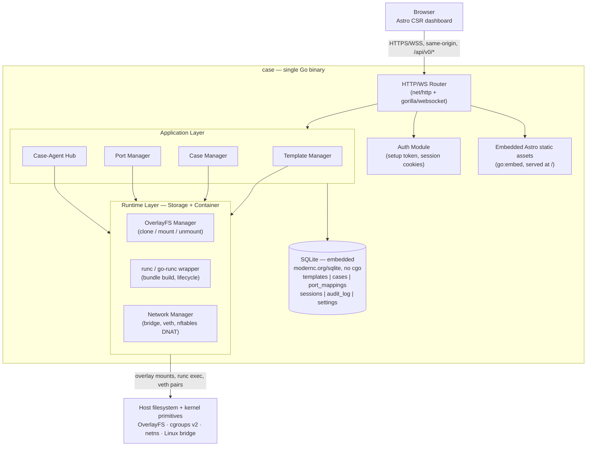

### 5.2 Why not just use the Docker daemon?

The Template-storage model the user wants — a Template *is* a directory holding the full contents of a container's `/`, and cloning is a cheap filesystem operation — doesn't map cleanly onto how the Docker daemon manages images and containers internally (Docker owns its layers through its own storage driver; you don't get a plain directory back that you can hand to a *new* container as its literal root).

What the user described **is** the OCI runtime bundle model almost exactly: a `runc` bundle is a directory with a `rootfs/` subdirectory and a `config.json` next to it, and `rootfs/` really is just a plain directory on disk that `runc` chroots/pivot-roots into. This document designs around `runc` directly (via `go-runc`, the same Go wrapper library `containerd` itself uses to drive `runc`), **not** the Docker Engine API, and **not** the full `containerd` daemon either — a persistent `containerd` daemon brings gRPC, snapshotter plugins, and image-content-store machinery designed for multi-tenant, multi-client use that this single-user tool doesn't need. Shelling out to the `runc` CLI (through `go-runc`'s typed wrapper) from the Go binary directly is the smallest correct piece of standard, well-tested container tooling for this job.

This has one direct consequence worth being explicit about: **the Docker daemon also does your networking and port-publishing for you, invisibly.** Dropping straight to `runc` means Case's own Go code has to set up network namespaces, veth pairs, a bridge, and NAT/port-forwarding rules itself (§10). This is a well-trodden pattern (it's exactly what Docker's own network driver and every CNI plugin do under the hood), but it is genuinely new work this design has to account for — it isn't free just because `runc` is simpler at the storage layer.

### 5.3 Process Model

- **Case** runs as a single long-lived root (or capability-scoped) process — no daemon-izing into the background, no client/server split within the binary itself.
- Each Case is a **separate `runc` container process tree**, parented under Case's own PID as far as process supervision goes (Case watches `runc`-launched container init PIDs and reacts to unexpected exits), but namespaced away from Case's own PID/mount/network/UTS/IPC namespaces.
- The template-builder SSH console and a running Case's optional console both work the same way: Case shells out to `runc exec -t --console-socket <path> <container-id> <shell>`, receiving the PTY master file descriptor over a Unix socket (the way `runc` requires — see §12.3), and pipes it over a WebSocket to the browser's xterm.js-style terminal.

---

## 6. On-Disk Layout

```
/var/lib/case/                          (configurable root data directory)
├── case.db                              # SQLite database file (+ case.db-wal, case.db-shm)
├── config.yaml                          # host-level config: data dir, LAN bind address, port ranges, etc.
├── setup.token                          # present only until first account is created; then deleted
├── templates/
│   └── <template-id>/
│       ├── rootfs/                      # the OverlayFS lowerdir — read-only once saved
│       ├── meta.json                    # name, author, base image ref, created_at, size_bytes
│       └── build.log                    # captured console output from the SSH build session
├── cases/
│   └── <case-id>/
│       ├── upper/                       # OverlayFS upperdir — this Case's private writable delta
│       ├── work/                        # OverlayFS workdir (opaque scratch space overlayfs needs)
│       ├── merged/                      # the mountpoint — this IS the Case's "/" while running
│       ├── bundle/
│       │   └── config.json              # the OCI runtime spec for this Case, regenerated on each start
│       └── meta.json                    # name, template_id, resource limits, startup command, ports
├── network/
│   └── leases.json                      # bridge subnet + per-Case IP/veth allocation table
└── logs/
    └── audit.log                        # append-only audit trail (see §17.4)
```

Rationale for keeping `templates/<id>/rootfs` and `cases/<id>/{upper,work,merged}` as siblings under the same top-level data directory rather than scattering them: OverlayFS **requires** the `upperdir` and `workdir` to live on the same underlying filesystem as each other (though the `lowerdir` can be elsewhere). Keeping everything under one configurable root also makes "where do I point my backup tool" a one-line answer.


---

## 7. Storage & Cloning Design

### 7.1 The core mechanism: OverlayFS, not copying

The requirement was storage that's "cheap, performant, and only diverges when it needs to." That's a description of copy-on-write, and the cleanest way to get it at the *whole-filesystem* level on Linux — without requiring a specific host filesystem like Btrfs or ZFS — is **OverlayFS**, a stackable union filesystem that's been in the kernel since 3.18 and is enabled by default on essentially every modern distro.

The mental model:

- A **Template's** saved `rootfs/` directory is mounted as a **read-only `lowerdir`**.
- Each **Case** gets its own, initially-empty **`upperdir`** and **`workdir`** (a scratch directory OverlayFS uses internally to atomically stage renames/deletes — never touched directly by anything else).
- The three are mounted together into a **`merged`** view, and *that* merged directory is what gets handed to `runc` as the container's `rootfs`.

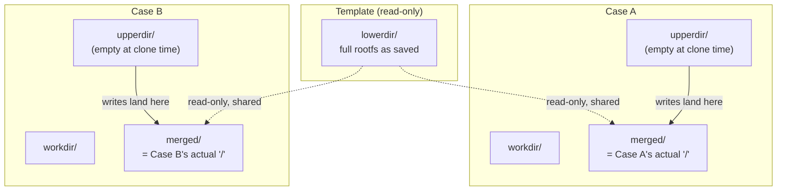

Both Case A and Case B share the exact same on-disk `lowerdir` bytes. Nothing is copied at clone time. The mount command is, conceptually:

```bash
mount -t overlay overlay \
  -o lowerdir=/var/lib/case/templates/<template-id>/rootfs,\
upperdir=/var/lib/case/cases/<case-id>/upper,\
workdir=/var/lib/case/cases/<case-id>/work \
  /var/lib/case/cases/<case-id>/merged
```

### 7.2 What "clone" actually does, step by step

1. Create `cases/<case-id>/{upper,work,merged}/` — three empty directories. This is the entire "clone" operation: no file in the Template is read or copied.
2. Mount the overlay as shown above.
3. Generate `cases/<case-id>/bundle/config.json` (the OCI spec, §8) pointing its `root.path` at `merged/`.
4. Hand the bundle to `runc create` / `runc run`.

**Copy-up behavior** (this is what "only diverges when it needs to" means concretely): the first time anything inside the Case writes to, say, `/etc/hostname`, the kernel transparently copies that one file from the `lowerdir` into the `upperdir` before applying the write. Every other untouched file continues to be served straight from the shared, read-only Template data. Delete a file that only exists in the lowerdir and OverlayFS records a "whiteout" marker in the upperdir rather than being able to touch the read-only lower copy.

### 7.3 Why not Btrfs/ZFS reflink snapshots instead

Reflink-based copy-on-write (Btrfs, XFS with reflink, ZFS clones) is a legitimate alternative and is in some ways more "complete" (it also gets you fast whole-subvolume snapshots, quotas per snapshot, etc.), but it requires committing the entire host's data partition to one specific filesystem. OverlayFS requires nothing beyond whatever ext4/xfs/btrfs partition is already there — it's a stackable filesystem layered on top of any of them. Given Case is meant to be something a person can drop onto whatever server or workstation they already have, not requiring a specific host filesystem is a meaningfully easier install story, and OverlayFS's copy-up granularity (per-file) is a good match for a dev environment's actual access pattern anyway (a handful of dotfiles and project directories change; the base OS and toolchain almost never do).

### 7.4 Cleanup and disk accounting

- **Deleting a Case**: unmount `merged/`, then `rm -rf` the Case's `upper/`, `work/`, and `merged/` directories. The Template's `lowerdir` is completely untouched — deleting one Case, or a hundred, never risks the shared base.
- **"Reset" during template building** (§13.4): with this model, "reset" on an in-progress template build is just as cheap as a normal Case reset would be — wipe the `upperdir` back to empty and remount, instantly reverting to the base image's pristine state without destroying and recreating the container process.
- **Disk usage reporting**: because only the `upperdir` grows per-Case, `du -sh cases/<case-id>/upper` gives an accurate "how much has this Case diverged from its Template" figure directly, useful for the dashboard's per-Case storage stat and for spotting Cases that have silently ballooned (e.g. from build caches or downloaded datasets).
- **Multiple Cases from an updated Template**: because each Case's `lowerdir` reference is fixed at clone time to that Template's `rootfs/` path, saving a new version of a Template (§13.5) does not retroactively change any existing Case — by design, matching the "forked forever" model used by GitHub Codespaces.


---

## 8. Container Runtime Design

### 8.1 The OCI bundle

Every Case (and every in-progress Template build) is, at the moment it's running, an OCI runtime bundle:

```
cases/<case-id>/bundle/
└── config.json         # the OCI runtime spec — regenerated fresh on every start
```

with `root.path` pointing at `../merged` (the OverlayFS mount from §7). `config.json` is generated by Case's own Go code from the Case's stored metadata (resource limits, ports, startup command) each time the Case is started — it is never hand-edited or persisted as the source of truth; the database row is the source of truth, and `config.json` is a derived artifact.

### 8.2 A representative `config.json` for a Case

```json
{
  "ociVersion": "1.0.2",
  "root": { "path": "../merged", "readonly": false },
  "hostname": "case-<name>",
  "process": {
    "terminal": false,
    "user": { "uid": 0, "gid": 0 },
    "args": ["code-server", "--bind-addr", "0.0.0.0:8080", "--auth", "none"],
    "env": [
      "PATH=/usr/local/sbin:/usr/local/bin:/usr/sbin:/usr/bin:/sbin:/bin",
      "TERM=xterm-256color",
      "container=runc"
    ],
    "cwd": "/root",
    "capabilities": {
      "bounding": ["CAP_SYS_ADMIN", "CAP_NET_BIND_SERVICE", "CAP_AUDIT_WRITE", "CAP_KILL", "CAP_SYS_CHROOT"],
      "effective": ["CAP_SYS_ADMIN", "CAP_NET_BIND_SERVICE", "CAP_AUDIT_WRITE", "CAP_KILL", "CAP_SYS_CHROOT"]
    }
  },
  "mounts": [
    { "destination": "/proc", "type": "proc", "source": "proc" },
    { "destination": "/dev", "type": "tmpfs", "source": "tmpfs", "options": ["nosuid","strictatime","mode=755","size=65536k"] },
    { "destination": "/dev/pts", "type": "devpts", "source": "devpts", "options": ["nosuid","noexec","newinstance","ptmxmode=0666","mode=0620"] },
    { "destination": "/sys", "type": "sysfs", "source": "sysfs", "options": ["nosuid","noexec","nodev","ro"] },
    { "destination": "/sys/fs/cgroup", "type": "cgroup", "source": "cgroup", "options": ["rw","nosuid","noexec","nodev"] },
    { "destination": "/run", "type": "tmpfs", "source": "tmpfs", "options": ["nosuid","strictatime","mode=755"] },
    { "destination": "/run/lock", "type": "tmpfs", "source": "tmpfs", "options": ["nosuid","noexec","nodev"] }
  ],
  "linux": {
    "namespaces": [
      { "type": "pid" }, { "type": "ipc" }, { "type": "uts" },
      { "type": "mount" }, { "type": "network" }, { "type": "cgroup" }
    ],
    "cgroupsPath": "/case.slice/case-<case-id>.scope",
    "resources": {
      "cpu": { "quota": 200000, "period": 100000 },
      "memory": { "limit": 4294967296 }
    },
    "maskedPaths": [
      "/proc/kcore", "/proc/keys", "/proc/latency_stats", "/proc/timer_list", "/proc/sched_debug"
    ],
    "readonlyPaths": ["/proc/bus", "/proc/fs", "/proc/irq", "/proc/sys", "/proc/sysrq-trigger"]
  }
}
```

Notes on the choices baked into this template:

- **`network` and `cgroup` namespaces are per-Case** (not shared/host) — this is what gives each Case its own loopback, its own view of `/sys/fs/cgroup`, and is what makes the bridge+veth networking model in §9 necessary in the first place.
- **The default `maskedPaths`/`readonlyPaths` list from the OCI default spec is trimmed down**, not the full default set — the stock list masks several `/proc/*` entries that `systemd` itself expects to read (kernel/OCI reference: [systemd's own container-interface contract](https://systemd.io/CONTAINER_INTERFACE/) documents exactly what a container manager needs to provide for `systemd` to behave as PID 1 without falling back into workarounds).
- **`container=runc` env var**: `systemd` detects whether it's running inside a container via `systemd-detect-virt`, and behaves very differently (skips hardware-init steps that don't make sense in a container, avoids remounting things it shouldn't) once it knows it's contained. Setting this explicitly avoids `systemd` misbehaving because it thinks it has a bare-metal environment.

### 8.3 systemd-in-container: the capability trade-off

The requirement that Template containers "act like proper systems" (systemd enabled) has one unavoidable, well-documented cost: **`systemd` needs to manage cgroups itself**, and doing that from inside a container needs either:

- **`CAP_SYS_ADMIN`** in the container's capability set, plus a writable `/sys/fs/cgroup` mount (the traditional approach, used by essentially every "systemd-in-Docker" image in the wild), or
- **cgroup namespace + delegated unified-hierarchy access** without the blanket `CAP_SYS_ADMIN` grant, which is possible on systemd ≥ 245 with cgroups v2 and a properly cgroup-namespaced container, but is fiddlier to get exactly right and more sensitive to the exact host `systemd`/kernel version.

**Decision for this draft:** grant `CAP_SYS_ADMIN` (approach one). It's the well-trodden, broadly-compatible path, and — importantly — this is a single-user, LAN-only tool: the security boundary that matters most here is Case-to-Case and Case-to-host isolation via namespaces, not defense against a maximally hostile untrusted tenant. `CAP_SYS_ADMIN` inside a namespaced container is a meaningfully bigger blast radius than a minimal container *if something inside that container manages to escape the namespace*, but it does not on its own grant access to the host's root filesystem or other Cases. This is flagged again in §17 as a security trade-off worth revisiting if Case's threat model ever changes (e.g. if multi-user support is ever added later).

### 8.4 Case lifecycle states

```mermaid
stateDiagram-v2
    [*] --> Created: runc create (bundle built, not yet running)
    Created --> Running: runc start
    Running --> Stopped: user stop / runc kill + wait
    Stopped --> Running: user start (re-runs runc create+start against\nthe SAME upperdir — filesystem state preserved)
    Running --> Running: user restart (soft reboot — systemd reboot\ninside the container; process tree restarts,\ncontainer itself is not destroyed)
    Stopped --> [*]: user delete (unmount overlay, rm upper/work/merged)
    Running --> [*]: user delete (stop first, then as above)
```

"Restart" (a soft reboot that "continues where they left off," per the requirement) is implemented as `systemctl reboot` issued *inside* the container via `runc exec`, relying on `systemd`'s own reboot handling — the OCI container process (PID 1 = `systemd`) re-execs itself through the container-aware reboot path rather than the runc-level container being torn down and recreated. "Stop" followed later by "start" is a heavier operation: `runc delete` the old container process, then `runc create`+`runc start` a fresh one against the *same* `upperdir`/`merged` mount — the filesystem state (and therefore anything the user's Template or Case work has saved to disk) is untouched either way; only the process tree is discarded and rebuilt on a full stop/start.


---

## 9. Networking & Port Exposure

### 9.1 Why this needs its own subsystem

Dropping to `runc` directly (§5.2) means Case gets *no* networking for free — `runc` will happily give a container its own network namespace, but leaves it with nothing inside except a loopback interface unless something else wires it up. Docker normally does this invisibly via its bridge driver; here, Case's own Go code is that "something else."

### 9.2 The model: one Linux bridge, one veth pair per Case

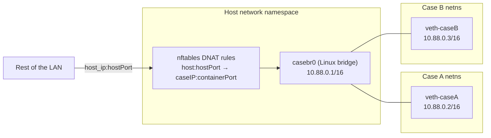

- On first run, Case creates a Linux bridge (`casebr0`) with a private subnet (default `10.88.0.0/16`, configurable) that never leaves the host.
- On Case *creation* (not every start), a `veth` pair is allocated: one end goes into the Case's network namespace (renamed to something predictable like `eth0` inside), the other end is attached to `casebr0`. The Case gets a stable IP from the subnet, recorded in `network/leases.json` and in the `cases` table (§10) — stable across stop/start so that port-forward rules don't need to be rewritten every time a Case restarts.
- **Outbound** traffic from a Case (e.g. `apt install`, `git clone`, `npm install`) is handled by a single `MASQUERADE` rule on the bridge's egress — standard NAT, same as any home router.
- **Inbound / port exposure** (the actual feature being asked for — "make that port from that container available" on the LAN) is one `nftables` DNAT rule per exposed port: `host_ip:<hostPort> → <caseIP>:<containerPort>`. This is exactly what Docker's `-p hostPort:containerPort` does under the hood, implemented directly instead of through the Docker daemon.

### 9.3 Port allocation

- Ports requested at Case-creation time (the form's "ports to expose" field) get **fixed host-side ports** chosen either by the user or auto-assigned from a configurable free range (default `40000–40999`) — recorded in the `port_mappings` table (§10) so they're stable across restarts.
- Ports requested **later, at runtime, by the Case-Agent extension** (§15) go through the same allocator but are added/removed live: a new `nftables` rule is inserted or deleted without touching the Case's process or any other port mapping.

### 9.4 Two forwarding sequences, side by side

**At Case creation** (from the dashboard form):

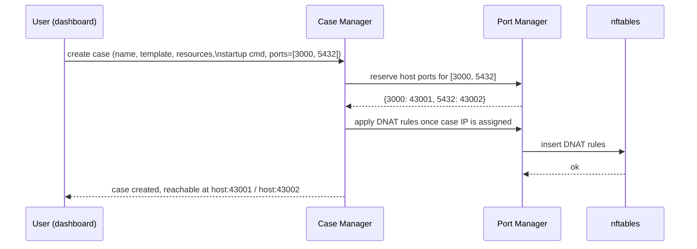

**At runtime, from inside the editor** (the Case-Agent extension, §15):

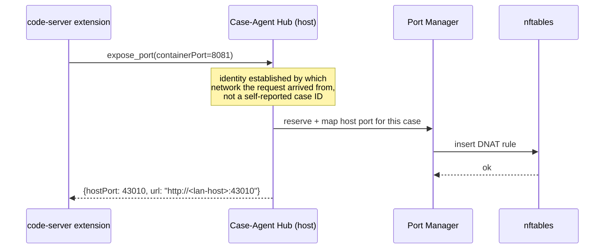

### 9.5 Security note

Because every exposed port lands on the **LAN-facing host IP** with no additional auth layer of its own (Case does not proxy or authenticate traffic to exposed ports — it only does the DNAT), whatever service is listening on that port is exactly as exposed as if it were run directly on the host. This is an accepted trade-off for a single-user LAN tool but is worth stating plainly rather than leaving implicit: **Case's auth model (§12) protects the dashboard and the Case-Agent channel — it does not protect whatever a Case chooses to expose.**


---

## 10. Data Model

### 10.1 Choice of database: SQLite, not Postgres

The author's other project (cockpit-alternative) hard-requires PostgreSQL, but that's a multi-node system with concurrent writers from several machines. Case is a **single binary meant to run on one machine for one person** — requiring a separately-running Postgres server would contradict the single-binary distribution goal outright. **`modernc.org/sqlite`** (a mature, pure-Go, cgo-free SQLite driver — no C toolchain needed at build time, works with `CGO_ENABLED=0` cross-compiles) embeds directly into the same binary, with the `.db` file living under the data directory from §6. WAL mode is enabled at startup for better concurrent-read behavior while a background operation (e.g. a Template build) is writing.

### 10.2 Entity-relationship overview

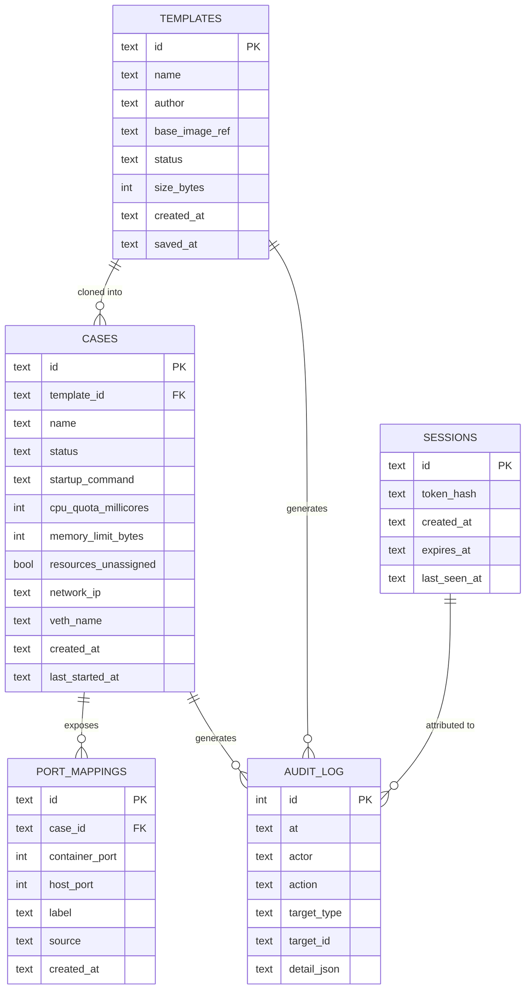

### 10.3 Table definitions

**`templates`**

| Column | Type | Notes |
|---|---|---|
| `id` | TEXT (UUID) | Primary key |
| `name` | TEXT | User-supplied at creation |
| `author` | TEXT | User-supplied at creation |
| `base_image_ref` | TEXT | e.g. `docker.io/library/ubuntu:24.04` — only used at build time to seed the initial rootfs |
| `status` | TEXT | `building` \| `saved` \| `failed` |
| `size_bytes` | INTEGER | Computed at save time (`du -sb rootfs/`) |
| `created_at` / `saved_at` | TEXT (ISO 8601) | |

**`cases`**

| Column | Type | Notes |
|---|---|---|
| `id` | TEXT (UUID) | Primary key |
| `template_id` | TEXT | FK → `templates.id` |
| `name` | TEXT | User-supplied |
| `status` | TEXT | `stopped` \| `running` \| `restarting` |
| `startup_command` | TEXT | Defaults to `code-server`; any command present in the template's rootfs |
| `cpu_quota_millicores` / `memory_limit_bytes` | INTEGER, nullable | `NULL` when `resources_unassigned = true` |
| `resources_unassigned` | BOOLEAN | If true, no cgroup quota is set — Case can use whatever the host has free |
| `network_ip` / `veth_name` | TEXT | Assigned once at creation, stable across the Case's lifetime |
| `created_at` / `last_started_at` | TEXT | |

**`port_mappings`**

| Column | Type | Notes |
|---|---|---|
| `id` | TEXT (UUID) | Primary key |
| `case_id` | TEXT | FK → `cases.id` |
| `container_port` | INTEGER | Port as seen inside the Case |
| `host_port` | INTEGER | Port as seen on the LAN |
| `label` | TEXT, nullable | Optional user- or extension-supplied label ("dev server", "postgres") |
| `source` | TEXT | `creation_form` \| `case_agent` — where the mapping came from, useful for the dashboard to distinguish "ports you configured up front" from "ports the extension opened on the fly" |
| `created_at` | TEXT | |

**`sessions`**

| Column | Type | Notes |
|---|---|---|
| `id` | TEXT (UUID) | Primary key, also the session cookie's value |
| `token_hash` | TEXT | Argon2id hash — the session token itself is never stored in plaintext |
| `created_at` / `expires_at` / `last_seen_at` | TEXT | |

**`audit_log`**

| Column | Type | Notes |
|---|---|---|
| `id` | INTEGER | Autoincrement primary key |
| `at` | TEXT | Timestamp |
| `actor` | TEXT | `user` \| `case_agent:<case_id>` \| `system` |
| `action` | TEXT | e.g. `case.create`, `case.start`, `template.save`, `port.expose` |
| `target_type` / `target_id` | TEXT | What the action applied to |
| `detail_json` | TEXT | Free-form structured detail for that action type |

Since Case is single-user, there is deliberately **no `users` table** — the one account's credential material (password hash, or whatever auth mechanism §12 settles on) lives in a single row of a `settings` key-value table rather than a full user model, since there is only ever one row that could exist.


---

## 11. API Design

Same-origin, no version-less scheme (matching the versioning decision the author already settled on for cockpit-alternative): all HTTP endpoints live under **`/api/v0/`**. WebSocket endpoints are listed separately since they're long-lived, bidirectional, and don't fit a request/response table cleanly.

### 11.1 REST endpoints

| Method | Path | Purpose |
|---|---|---|
| `POST` | `/api/v0/setup` | First-run only: consumes the setup token, creates the single account. Disabled once an account exists. |
| `POST` | `/api/v0/login` | Creates a session, sets the session cookie. |
| `POST` | `/api/v0/logout` | Invalidates the current session. |
| `GET` | `/api/v0/templates` | List all Templates. |
| `POST` | `/api/v0/templates` | Create a Template (name, author, base image ref) → spins up the build container, returns its id. |
| `GET` | `/api/v0/templates/:id` | Template detail (status, size, build log). |
| `POST` | `/api/v0/templates/:id/save` | Stop the build container, persist rootfs, mark `saved`. |
| `POST` | `/api/v0/templates/:id/reset` | Wipe the build container's upperdir back to the base image state. |
| `POST` | `/api/v0/templates/:id/restart` | Soft-reboot the build container (systemd reboot). |
| `DELETE` | `/api/v0/templates/:id` | Delete a Template. Refuses if any Case still references it. |
| `GET` | `/api/v0/templates/:id/stats` | Point-in-time CPU/RAM/storage snapshot (polled by the sidebar; see also the WS stream below). |
| `GET` | `/api/v0/cases` | List all Cases. |
| `POST` | `/api/v0/cases` | Create a Case (name, template_id, resources or unassigned, startup_command, ports[]). |
| `GET` | `/api/v0/cases/:id` | Case detail. |
| `POST` | `/api/v0/cases/:id/start` \| `/stop` \| `/restart` | Lifecycle transitions (§8.4). |
| `DELETE` | `/api/v0/cases/:id` | Stop (if running) then delete filesystem state. |
| `GET` | `/api/v0/cases/:id/ports` | List this Case's port mappings. |
| `POST` | `/api/v0/cases/:id/ports` | Add a port mapping (used both by the creation form and — internally — by the Case-Agent Hub). |
| `DELETE` | `/api/v0/cases/:id/ports/:mappingId` | Remove a port mapping. |
| `GET` | `/api/v0/audit-log` | Paginated audit trail, filterable by target/action. |

### 11.2 WebSocket endpoints

| Path | Direction | Purpose |
|---|---|---|
| `/api/v0/templates/:id/console` | bidirectional | The template-builder PTY session — raw terminal I/O plus resize control messages. |
| `/api/v0/templates/:id/stats/stream` | server→client | Live CPU/RAM/storage push for the build-page sidebar (§13.4), avoiding a client-side poll loop. |
| `/api/v0/cases/:id/console` | bidirectional | Optional direct terminal access to a running Case (separate from `code-server` itself — useful before `code-server` has even started, or for headless Cases). |
| `/api/v0/cases/:id/stats/stream` | server→client | Live per-Case resource usage for the dashboard. |
| `/api/v0/agent-hub` (internal, not browser-facing) | bidirectional | The channel the Case-Agent Hub (§15) listens on per-Case network namespace — not exposed to the dashboard's own origin; this is the extension's private wire. |


---

## 12. Authentication & Session Management

### 12.1 First run: the setup token

```mermaid
sequenceDiagram
    participant Term as Host terminal
    participant Case as case binary
    participant Browser as Browser

    Case->>Term: prints setup token on startup (only while no account exists)
    Note over Case: /api/v0/setup is the ONLY endpoint\nthat responds while unconfigured;\nall other routes return 403
    Browser->>Case: GET / → redirected to /setup
    Browser->>Case: POST /api/v0/setup {token, username, password}
    Case->>Case: validate token, hash password,\nwrite the single account row,\ndelete setup.token file
    Case-->>Browser: 200, redirect to /login
```

This is the same shape as the Owner-creation flow already designed for the author's cockpit-alternative project, simplified because there's only ever one account and no roles: no "Owner vs Admin vs User" distinction is needed here at all.

### 12.2 Session model

- A successful `/api/v0/login` issues an HttpOnly, `SameSite=Strict` session cookie. The cookie value is a random session id; the corresponding `token_hash` row (§10.3) is what's actually checked server-side — the raw token itself is never persisted.
- Sessions expire on a rolling idle timeout (default 12 hours — longer than the 1-hour web-session timeout chosen for the multi-user cockpit-alternative project, since Case's single owner is far less likely to be sharing a browser session with anyone else).
- **CSRF protection** and a per-request auth check apply uniformly to every `/api/v0/*` route except `/api/v0/setup` (before an account exists) and `/api/v0/login`.

### 12.3 Template-builder SSH console security

The "very very high security" requirement for the SSH-like builder console is met with the following layers, deliberately mirroring the pattern already chosen for cockpit-alternative's console (WS-wrapped PTY, session-scoped credentials, no long-lived keys) rather than inventing a second security model:

1. The console is **not real SSH** — no `sshd` runs inside the build container, no keypair is generated or exchanged with the user. Instead, the browser opens an authenticated WebSocket (requires the same session cookie as the rest of the dashboard) directly to `/api/v0/templates/:id/console`.
2. Server-side, that WS handler shells out to `runc exec -t --console-socket <tmp-socket> <container-id> <shell>`. `runc` requires a Unix domain socket to hand back the PTY master file descriptor via `SCM_RIGHTS` — Case listens on a short-lived socket created fresh per session (via the `containerd/console` package's helper, the same library `containerd` itself uses for this exact purpose) and immediately wires the returned FD's read/write streams to the WebSocket frames.
3. Because the console is reached through the same authenticated dashboard session as everything else, there is no separate credential to leak, rotate, or accidentally leave lying around — the security boundary is "does this browser have a valid Case session," full stop.
4. Every keystroke session is attributable in the audit log (`actor = user`, `action = template.console.exec`) even though the log doesn't (and shouldn't) capture the actual terminal transcript.

This avoids the complexity and failure modes of standing up and securing an actual `sshd` + keypair distribution flow for something that, functionally, is just "give me a terminal in this container" — the WS+`runc exec` approach gets the same end-user experience with a much smaller, easier-to-reason-about security surface.


---

## 13. Template Lifecycle

The scratch-style visual builder is **out of scope for this draft** (deferred per §3.2) — Template creation happens through the SSH-granular flow only, described in full below.

### 13.1 Creation form

Collected up front, before any container is spun up:

| Field | Notes |
|---|---|
| Name | Required, unique |
| Base image reference | e.g. `docker.io/library/ubuntu:24.04` — resolved and its rootfs extracted once, at build start, into the new Template's `rootfs/` directory (the same `docker export`-style flow shown in §8's reference material — pull the image, export its filesystem into a bare directory, no running Docker daemon required afterward) |
| Author info | Free text |

### 13.2 End-to-end flow

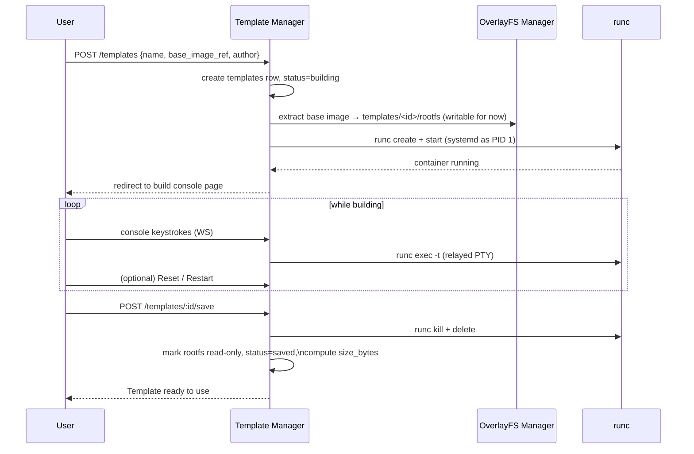

Note that during the *build* phase, the Template's own `rootfs/` is temporarily the **writable root** of the build container directly (not yet wrapped in an OverlayFS clone) — there's nothing to clone from yet, since this container *is* what will become the lowerdir. Once saved, that directory is remounted/marked read-only and becomes the immutable `lowerdir` every future Case (and this document treats them as forked-forever, per §7.4) clones from.

### 13.3 The build console page

Layout, per the requirement:

- **Main pane**: full-PTY terminal (xterm.js on the frontend, wired to `/api/v0/templates/:id/console` per §12.3), with full color/formatting support.
- **Right sidebar**:
  - **Save** — triggers §13.2's save step. Confirms with the user first (irreversible: after saving, the rootfs becomes read-only and further changes require creating a new Template or, later, a Template version — see §19).
  - **Reset** — wipes progress back to the freshly-extracted base image. Cheap and instant thanks to the same OverlayFS mechanism used for Cases (§7.4) — even though the build container itself isn't clone-based yet at this stage, "reset" can be implemented identically by keeping the *extracted-but-untouched* base image bytes aside as an implicit lowerdir from the very start of the build, rather than writable-in-place. (This is a refinement worth calling out: doing the build itself as an overlay — base image as lowerdir, `rootfs-in-progress` as upperdir — from step one, rather than writable-in-place, means Reset is symmetric with every other overlay operation in the system and costs nothing extra to implement.)
  - **Restart** — soft reboot (§8.4), preserves all filesystem state.
  - **Live stats**: CPU / RAM / storage used vs. available, pushed over `/api/v0/templates/:id/stats/stream` — sourced from the container's cgroup accounting on the host side; no in-guest agent is needed for this (the host already sees cgroup usage from outside, the same way `docker stats` works without anything running inside the container).

### 13.4 Reset vs. Restart — the distinction, made explicit

| Action | What happens to the filesystem | What happens to the process tree |
|---|---|---|
| **Restart** | Untouched | Rebooted (`systemctl reboot` inside; the container process re-execs through its own init) |
| **Reset** | Wiped back to the base image (upperdir emptied) | Also restarted, since the running processes were operating on state that no longer exists |

### 13.5 Immutability after save

Once saved, a Template's `rootfs/` is treated as **immutable** — every Case cloned from it shares that exact byte-for-byte state as their `lowerdir` forever. There is, in this draft, no "edit an existing Template" flow; producing an updated Template means starting a new build (possibly using the old Template's saved rootfs as the *base image* for the new one, if that path is wired up — flagged as an open question in §20). This keeps the OverlayFS sharing model in §7 simple: a `lowerdir` that could change out from under Cases already using it would break the entire cheap-cloning guarantee.


---

## 14. Case Lifecycle

### 14.1 Creation form

| Field | Notes |
|---|---|
| Name | Required, unique |
| Template | Dropdown of `saved` Templates |
| Resources | Either explicit CPU/RAM/storage caps, or **"unassigned / use as needed"** — in which case no cgroup quota is set at all (the Case competes for host resources like any normal process, uncapped) |
| Startup command | Defaults to `code-server`; free text otherwise, must be a binary/script present in the Template's rootfs |
| Ports to expose | Zero or more `{containerPort, [optional label]}` entries — resolved to host ports at creation time per §9.3 |

### 14.2 End-to-end flow

```mermaid
sequenceDiagram
    participant U as User
    participant CM as Case Manager
    participant OV as OverlayFS Manager
    participant NM as Network Manager
    participant RC as runc

    U->>CM: POST /cases {name, template_id, resources, startup_cmd, ports}
    CM->>CM: insert cases row, status=stopped
    CM->>OV: create upper/, work/, merged/; mount overlay\n(lowerdir = template's rootfs)
    CM->>NM: allocate veth pair + IP from casebr0 subnet
    CM->>CM: generate bundle/config.json (resources, startup_cmd as process.args)
    CM->>RC: runc create + start
    RC-->>CM: container running, PID tracked
    CM->>NM: apply DNAT rules for requested ports
    CM-->>U: case running, reachable at host:<mapped ports>
```

### 14.3 "Unassigned" resources, precisely

When `resources_unassigned = true`, the generated `config.json`'s `linux.resources` block simply **omits** `cpu` and `memory` entries entirely, rather than setting an artificially high number. The Case's cgroup still exists (needed for accounting/stats and for the kernel to track the process group at all) but carries no quota — the Case can burst to use whatever the host has free, and is throttled only by genuine host-wide contention, exactly like an unconfigured process running directly on the host would be.

### 14.4 Stop / Start / Restart / Delete

Reuses the state machine defined in §8.4 — a Case and a Template-in-progress are, mechanically, the same kind of object (an OCI container backed by an overlay mount) with different lifecycles wrapped around them: a Template's build container is expected to end in exactly one `save`, while a Case is expected to be stopped and started repeatedly over its lifetime.

- **Stop**: `runc kill` (graceful, SIGTERM → SIGKILL after a grace period) + `runc delete`. The overlay mount and all port mappings are left in place — only the process tree goes away.
- **Start** (from stopped): fresh `runc create` + `runc start` against the *same* `merged/` mount and the *same* `network_ip`/`veth_name` — from the outside (LAN ports, filesystem contents), a stopped-then-started Case looks identical to one that was merely restarted, modulo the brief downtime.
- **Restart** (while running): soft reboot per §8.4, cheaper than a full stop/start cycle.
- **Delete**: stop first if running, then unmount the overlay and remove `upper/`, `work/`, `merged/`, release the veth pair and IP lease, remove all `port_mappings` rows. The Template itself is never touched.


---

## 15. VS Code Extension / Case-Agent Design

### 15.1 Shape of the thing

Per the decision already made: **the extension itself does the talking** — there is no separate compiled agent binary inside the Case that the extension shells out to (unlike the author's other project's `tmz` binary, which is a standalone Go process). The extension, running inside `code-server`'s Node-based extension host process (itself running inside the Case), opens a direct connection out to the host and speaks a small JSON-over-TCP protocol.

### 15.2 Transport and identity — reusing the `tmz` trust model

The trust problem is identical to the one already solved for the author's cockpit-alternative project's `tmz` agent, so this reuses the same shape rather than inventing a new one:

- A **fixed port** (e.g. `38411`, reusable per-Case precisely because each Case has its own isolated network namespace — no collision is possible between Cases) has a listener on the **host** side, reachable from inside each Case's netns via the bridge (§9.2).
- The extension, running inside the Case, dials **out** to that port.
- **Identity is established by which network the connection arrived from** — the Case-Agent Hub maps the source IP of an inbound connection (which is that Case's fixed, lease-assigned `network_ip` from §9.2/§10.3) back to a specific `case_id`, rather than trusting any self-reported identifier the extension might send. A compromised or misbehaving extension inside Case A cannot claim to be Case B, because the packets simply don't arrive from Case B's IP.
- **Direction of trust is one-way by construction**: the Case can only *ask* the Hub to do a fixed set of narrow things (below); the Hub never accepts arbitrary commands, and the wire protocol has no "run this shell command on the host" verb at all — unlike the SSH console (§12.3), which is an intentionally privileged, user-initiated channel, this extension channel is scoped to a small fixed action list from the start.

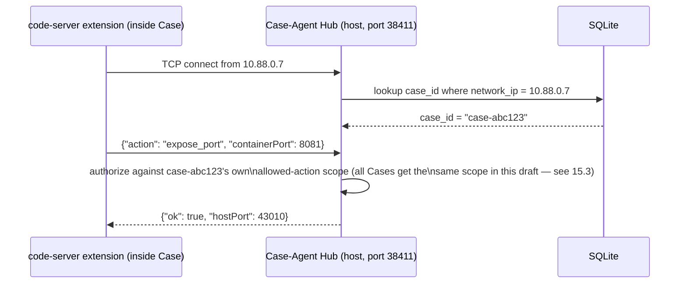

### 15.3 Finalized ability list

All of the suggested abilities are in scope, per the decision to accept them all:

| Ability | Wire action | What it does |
|---|---|---|
| **Port expose/forward** | `expose_port` | Requests a container port be DNAT'd to a LAN-reachable host port (§9.4). Returns the assigned host port so the extension can show a clickable link/status-bar entry in the editor. |
| **Live resource readout** | `get_stats` (or a subscribed push) | Surfaces this Case's current CPU/RAM usage into a `code-server` status bar item — sourced the same way as the Template build page's sidebar (§13.3), i.e. host-side cgroup accounting, not anything the extension measures itself. |
| **Manual checkpoint** | `checkpoint` | Lets the user trigger "commit current state right now" from the command palette instead of going back to the dashboard — useful immediately before doing something risky inside the Case. For a Case (unlike a Template), "checkpoint" doesn't mean the same thing as Template's `save` (a Case's overlay is already always persisted to disk); this ability is really a convenience audit-log marker plus, optionally, a triggered filesystem `sync`, rather than a new storage operation. |
| **Self restart** | `restart_self` | Same soft-reboot as the dashboard's Restart button (§8.4), callable from inside the editor without switching tabs. |
| **Env / secret injection** | `get_secret` | Broker-pattern secret retrieval: instead of an API key or credential being baked into the Template's rootfs in plaintext (where it would then be cloned into every Case made from that Template), a Case can request a named secret at runtime, which the Hub resolves from its own secret store (§17.3) and returns for the extension to inject as an environment variable or write to a short-lived file — never persisted inside the Case's own filesystem layer. |
| **Rename / describe** | `update_metadata` | Lets the user rename or annotate the Case from inside the editor; syncs back to the `cases.name` column so the dashboard reflects it immediately. |

### 15.4 Distribution — no marketplace dependency

The extension ships as a `.vsix` file baked directly into the **default master image** and installed at Template-build time via `code-server --install-extension /opt/case/case-agent.vsix` — `code-server` supports installing extensions directly from a local `.vsix` path on the command line, so **no publication to any extension marketplace (Microsoft's or Open VSX) is required at all.** This sidesteps two separate licensing questions at once (Microsoft's marketplace terms, and the general Microsoft-vs-Open-VSX split discussed in §17.1) simply by not depending on either registry for Case's *own* first-party extension — third-party extensions the user wants to install manually can still come from Open VSX, which is `code-server`'s own default gallery.


---

## 16. Build & Packaging

### 16.1 Single-binary assembly

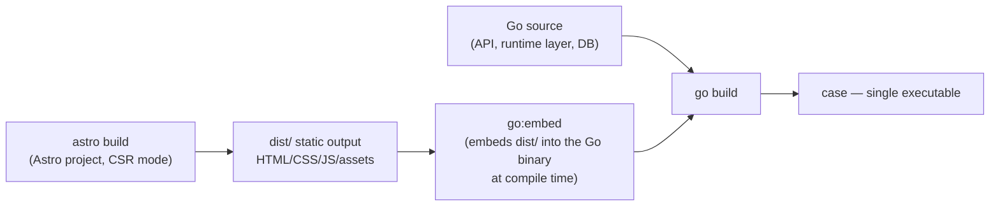

Concretely, the Go side embeds the frontend build output roughly as:

```go
//go:embed all:dist
var frontendAssets embed.FS

// dist/ is where `astro build` places its static output.
// Serve it at "/", with the API mounted separately under "/api/v0/".
```

The one common `go:embed` gotcha worth calling out explicitly (confirmed against Go's own tracked embed-path behavior): the embedded filesystem keeps the `dist/` prefix on every path, so the HTTP handler needs to either strip that prefix or use a small `fs.Sub(frontendAssets, "dist")` wrapper before handing it to `http.FileServer` — otherwise every request 404s against paths that are silently off by one directory level.

### 16.2 Build-time steps

1. `cd frontend && npm ci && npm run build` → produces `frontend/dist/`.
2. `go build -o case ./cmd/case` (with the `dist/` directory copied or symlinked to where the `go:embed` directive expects it, per whatever the actual repo layout ends up being — a `Makefile`/`justfile` target should wrap steps 1–2 into one command).
3. The resulting `case` binary is the entire deliverable — copy it to the target machine, run it.

### 16.3 Runtime dependencies not embedded in the binary

Two things are **not** bundled inside the Go binary itself and must be present on the host (or fetched/verified at first run):

- **`runc`** — a static, single binary in its own right; could be vendored alongside `case` in the same install directory (simplest: ship it as a second file next to the main binary and reference it by relative path) rather than requiring a system package install.
- **`nft` (nftables CLI) or the kernel's netlink interface directly** — for the DNAT/bridge rules in §9. Using Go's own `github.com/google/nftables` netlink library (rather than shelling out to the `nft` CLI) avoids even this external-binary dependency, and is the preferred approach precisely because it keeps the "just copy two files and run" install story intact.

### 16.4 Versioning

Following the `v0`-first API versioning scheme already chosen for the author's other project: `/api/v0/` now, with room to introduce `/api/v1/` later without breaking anything already deployed. The binary itself should expose its own build version (git SHA + build date) via a `/api/v0/version` endpoint, useful for the dashboard to show "you're on build X" and for support/debugging later.


---

## 17. Security Considerations

### 17.1 The VS Code binary licensing question — already resolved by the user's own default choice

Microsoft's license on the official, Microsoft-built VS Code Server binary restricts its use to Microsoft's own products (VS Code, Codespaces, Insiders) — it is not legally redistributable as part of a third-party self-hosted tool. This is exactly why two independent open-source forks exist instead:

- **`code-server`** (Coder's fork, MIT-licensed, completely free — not to be confused with Coder's separate paid enterprise *platform* product of the same company, which is a different thing built around it)
- **OpenVSCode-Server** (Gitpod's fork, also independently licensed)

The default startup command already chosen for Cases — **`code-server`** — *is* one of these two safe, MIT-licensed forks, not the restricted official Microsoft binary. This resolves the concern cleanly without needing any further decision: as long as the default master image installs `code-server` (rather than attempting to run Microsoft's own `vscode-server` binary), Case is on solid ground. This is worth stating explicitly in the Template-building documentation so a future version of the user (or anyone else reading this repo) doesn't accidentally "upgrade" the default image to the official Microsoft binary without realizing why that would be a licensing problem.

A secondary consequence of using `code-server`: its default extension gallery is **Open VSX**, not Microsoft's marketplace (Microsoft's marketplace terms of service similarly restrict use to Microsoft's own products) — already accounted for in §15.4, where Case's own first-party extension sidesteps the question entirely by shipping as a sideloaded `.vsix` rather than a marketplace publish.

### 17.2 systemd's `CAP_SYS_ADMIN` trade-off, restated plainly

As detailed in §8.3: granting `CAP_SYS_ADMIN` to every Case so that `systemd` can function is a real increase in what a fully-compromised Case's process could attempt against the kernel, compared to a minimal, capability-stripped container. This is judged acceptable **specifically because** Case's threat model is single-user/LAN-only — the person running Case is the same person whose code is running inside every Case. This judgment call should be revisited if this project ever grows a multi-user story (§19) where one user's Case might need to be defended against another user's.

### 17.3 Secret handling for the Case-Agent's `get_secret` ability

The Hub-side secret store (backing §15.3's `get_secret` action) should itself be encrypted at rest (e.g. via a key derived from the single account's password, or a separate machine-local key file with restrictive permissions) — a secret store that's just plaintext rows in the same SQLite file as everything else undermines the entire point of not baking credentials into a Template. This is flagged as an implementation requirement, not yet fully specified in this draft (the exact secret-store schema and encryption scheme is left as an open question in §20).

### 17.4 Audit logging

Every state-changing action — Template create/save/reset/restart/delete, Case create/start/stop/restart/delete, port mappings added/removed (whether from the creation form or the Case-Agent), secret retrievals — is written to the `audit_log` table (§10.3) with an `actor` field distinguishing the human user from a specific Case's agent. Since this is single-user, the audit log's primary value isn't "who did this" (there's only one who) but **"what happened, when, and from where"** — useful for reconstructing what a given Case did (e.g. which secrets it pulled, which ports it opened) after the fact, and for basic intrusion-detection value if a Case is ever compromised (an unexpected `get_secret` call for a secret that Case shouldn't need is a signal worth noticing).

### 17.5 Network isolation is the primary security boundary

To restate the point made throughout §7–§9: because `CAP_SYS_ADMIN` is granted per-Case (§17.2) and ports are exposed with no additional auth layer (§9.5), the properties actually doing the isolation work in this design are the **Linux namespaces** (mount, network, PID, UTS, IPC — each Case gets its own) and the **OverlayFS boundary** (a Case's writes only ever land in its own `upperdir`, never the shared `lowerdir`, never another Case's `upperdir`). Nothing in this design relies on capability-dropping alone to keep Cases apart from each other or from the host.


---

## 18. Operational Concerns

### 18.1 Host reboot / crash recovery

Since Case itself is a single long-running process (no daemon-izing, per §5.3), a host reboot kills both the `case` process and every `runc`-launched Case container process tree. On next start, `case` should reconcile its database against reality:

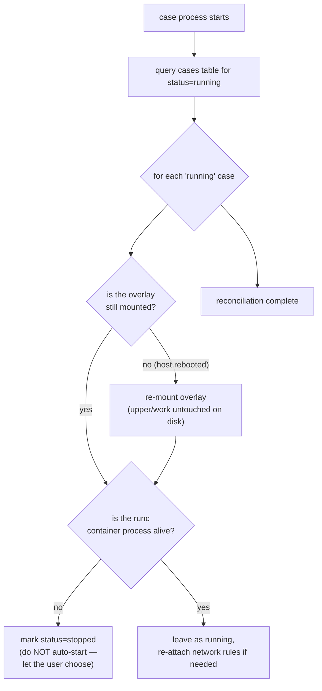

**Deliberate choice: do not auto-restart Cases after a host reboot.** A Case that was mid-build-process or running a long job when the host went down should surface as `stopped` and let the user decide whether to start it again, rather than silently resurrecting arbitrary startup commands on boot without the user present to notice something going wrong.

### 18.2 Logging

- **Application logs** (Go's own structured logging — startup, API errors, runc invocation failures) go to stdout/stderr, letting the user redirect them however they like (a log file, `journalctl` if run under systemd themselves, etc.) rather than Case reinventing log rotation.
- **Audit log** (§17.4) is a separate, structured, queryable trail specifically about user/Case actions — kept in SQLite rather than a flat file, since it's meant to be filtered/paginated through the dashboard's `/api/v0/audit-log` endpoint.

### 18.3 Backups

Because a Template's `rootfs/` and a Case's `upper/` are both just plain directories on disk, backing up the whole `/var/lib/case/` data directory with any standard tool (`rsync`, `restic`, `borg`, a filesystem snapshot if the host happens to be on Btrfs/ZFS anyway) is sufficient — there is no special export/import format Case needs to invent for this, unlike the S3-backed backup system planned for the author's cockpit-alternative project (which needs its own backup feature because it's managing *other people's* servers remotely; Case's own data directory backup is the user's own local concern).

### 18.4 Disk usage growth over time

Because Cases only grow via their `upperdir` (§7.4), a Case that's been running for months accumulating build caches, downloaded dependencies, and log files will show that growth directly in `du -sh cases/<id>/upper`. The dashboard's per-Case storage stat (already planned in §13.3/§14 via the stats stream) doubles as an early warning for "this Case has diverged a lot and might be worth trimming or recreating from a fresh Template clone."

---

## 19. Roadmap / Future Work / Explicitly Deferred

These are named directly rather than silently dropped, so a future revision of this document has a clear list to revisit:

- **The Scratch-style visual template builder** (§3.2) — dropped for this draft as "too complex" per the author's own call; if revisited, worth reusing the same block-editor *component* already being built for the cockpit-alternative project's scheduler (different block vocabulary, same underlying JSON-schema-driven visual editor), rather than building a second one from scratch.
- **Template versioning** — right now, saving a Template is a one-time, immutable operation (§13.5). A natural extension is versioned Templates (v1, v2, ...) where a new build can start from an existing Template's saved state as its base image, and Cases can pin to a specific version.
- **GPU passthrough** — explicitly out of scope (§3.2), but if ever added, it's a `config.json` device-node + `nvidia-container-toolkit`-equivalent addition at the runtime layer (§8), not a redesign of anything else in this document.
- **Multi-user** — if Case is ever used by more than one person (even just "you, from two different devices, wanting separate logins"), the `settings`-table single-account model (§10.3, §12) would need to become a real `users` table, and the `CAP_SYS_ADMIN`-for-systemd trade-off (§17.2) would need urgent revisiting, since it's currently justified specifically by the single-user assumption.
- **cgroup-namespace-delegated systemd without `CAP_SYS_ADMIN`** — flagged in §8.3 as the more locked-down alternative, deliberately not chosen for v1 for compatibility/simplicity reasons; worth a second look once the core system is stable.

---

## 20. Open Decisions Still Needed

Things this draft made a reasonable call on but that the author should explicitly confirm or override before implementation starts:

1. **Secret store encryption scheme** (§17.3) — password-derived key vs. a separate machine-local key file; not yet fully specified.
2. **Whether a saved Template can ever be used as the *base image* for a new Template build** (mentioned in passing in §13.5) — would let the user "fork" a Template rather than always starting from a raw base image like `ubuntu:24.04`.
3. **Default bridge subnet and port-range configurability** (§9) — `10.88.0.0/16` and `40000–40999` are reasonable stand-ins but should be confirmed as sensible for the author's actual LAN setup.
4. **Grace-period duration for `runc kill`'s SIGTERM→SIGKILL escalation** (§14.4) — not yet given a concrete default.
5. **Whether the Case-Agent Hub's per-Case allowed-action scope is ever meant to differ between Cases**, or whether every Case simply gets the same fixed ability list from §15.3 forever (this draft assumes the latter, for simplicity).

---

## 21. Appendix: Research References

- OCI runtime bundle / `config.json` format — `opencontainers/runc` project documentation and README.
- OverlayFS mount semantics (`lowerdir`/`upperdir`/`workdir`) — ArchWiki "Overlay filesystem," Gentoo Wiki "OverlayFS."
- `systemd` inside containers — [systemd's own CONTAINER_INTERFACE contract](https://systemd.io/CONTAINER_INTERFACE/); `CAP_SYS_ADMIN` requirement discussed across multiple `moby/moby` and `systemd/systemd` issue threads.
- `code-server` vs. OpenVSCode-Server vs. the official Microsoft VS Code Server binary — `coder/code-server`'s own FAQ documentation and licensing discussion threads; Open VSX as the default extensions gallery.
- `go:embed` for single-binary SPA serving — Go standard library `embed` package documentation; community write-ups on the `dist/`-prefix path gotcha.
- `creack/pty` and `containerd/console` for PTY handling in Go, including the `runc exec --console-socket` FD-handoff mechanism.
- `modernc.org/sqlite` as a mature, pure-Go, cgo-free SQLite driver suitable for single-binary distribution.

